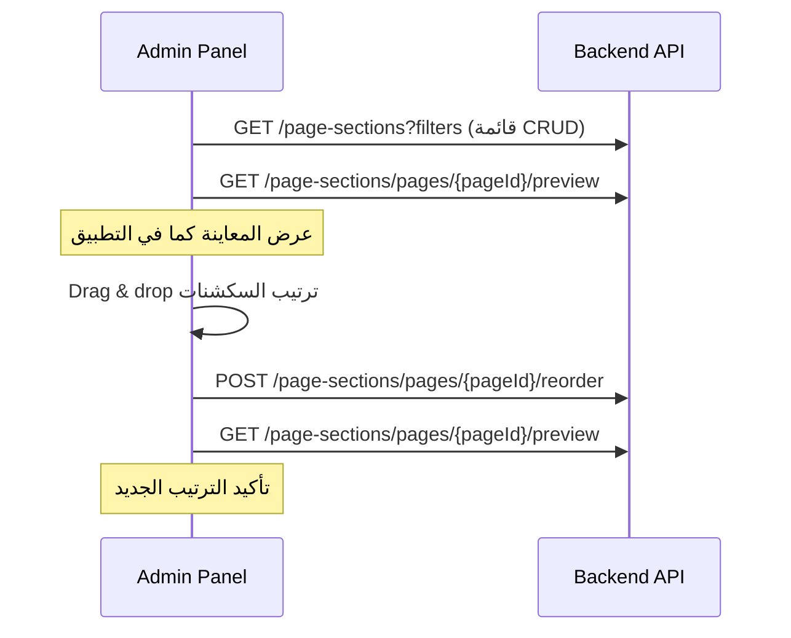

# Page Section API (Admin) — معاينة وإعادة الترتيب

توثيق endpoints جديدة لإدارة **أقسام الصفحة** (`page_sections`) من لوحة الأدمن، مع ربطها بما يراه المستخدم في التطبيق.

> **للفرونت:** هذا الملف يغطي الـ endpoints الجديدة فقط. الـ CRUD الكامل لـ `page-sections` يبقى عبر `GET/POST/PUT/DELETE /api/admin/page-sections` كما هو.

---

## Base

| البند | القيمة |
| --- | --- |
| Base URL | `/api/admin` |
| Auth | `Authorization: Bearer <admin_token>` |
| Guard | `auth:admin` على كل المسارات المحمية |
| Content-Type | `application/json` |

---

## Common Response Envelope

نجاح:

```json
{
  "status": true,
  "message": "Success",
  "data": {}
}
```

خطأ (تحقق / منطق):

```json
{
  "status": "error",
  "message": "Error",
  "errors": {
    "sections": ["Some page sections do not belong to this page."]
  }
}
```

| HTTP | المعنى |
| --- | --- |
| `200` | نجاح |
| `401` | غير مصادق |
| `403` | لا توجد صلاحية |
| `404` | الصفحة غير موجودة (`preview`) |
| `422` | فشل التحقق أو سكشن لا يتبع الصفحة (`reorder`) |

---

## الصلاحيات (Permissions)

| Endpoint | Permission |
| --- | --- |
| `GET .../preview` | `pagesection.view` |
| `POST .../reorder` | `pagesection.update` |

---

## 1) معاينة صفحة — كما يراها المستخدم

يعرض السكشنات **بنفس منطق** `GET /api/user/sections` (نشطة فقط، `show_when`، دمج بانرات متعددة).

### Request

```http
GET /api/admin/page-sections/pages/{page_id}/preview
Authorization: Bearer <admin_token>
```

| Param | الموقع | النوع | مطلوب | الوصف |
| --- | --- | --- | --- | --- |
| `page_id` | path | integer | نعم | `id` من جدول `pages` |
| أي مفتاح في `show_when` | query | string | لا | لتجربة ظهور سكشن مشروط، مثال: `?shop_id=3` إذا كان `show_when: { "shop_id": "3" }` |

### Response `data`

```json
{
  "page": {
    "id": 1,
    "slug": "home",
    "title": "Home"
  },
  "sections": []
}
```

- **`page`:** معلومات الصفحة المختارة.
- **`sections`:** مصفوفة بنفس شكل مورد المستخدم `PageSection\OneResource` (انظر الحقول أدناه).

### شكل عنصر واحد في `sections`

| الحقل | النوع | الوصف |
| --- | --- | --- |
| `id` | number | `page_sections.id` |
| `name` | string | اسم السكشن على الصفحة أو اسم الـ Section |
| `type` | string | نوع الـ Section: `manual` أو `api` |
| `position` | string | `before` أو `after` |
| `order` | number | ترتيب العرض |
| `display_type_id` | number \| null | نوع العرض |
| `variant` | string | `horizontal` \| `vertical` \| `square` |
| `background_color` | string \| null | |
| `background_card_color` | string \| null | |
| `end_date` | string \| null | يظهر لسكشن flash sale |
| `discount` | number \| null | |
| `discount_type` | string \| null | |
| `see_more` | object \| null | `{ page_slug, params }` |
| `show_when` | object \| null | شروط الظهور |
| `action` | object | `{ page_slug }` للتفاصيل |
| `items` | array | عناصر السكشن (يدوي أو API) |

### مثال طلب

```http
GET /api/admin/page-sections/pages/1/preview
Authorization: Bearer eyJ...
```

### مثال مع `show_when`

إذا سكشن له `show_when: { "category_id": "5" }`:

```http
GET /api/admin/page-sections/pages/1/preview?category_id=5
```

بدون `category_id=5` لن يظهر ذلك السكشن في المعاينة (مثل التطبيق).

### ملاحظات للفرونت

1. **لا تُعرض** السكشنات المعطّلة (`page_sections.is_active = false` أو `sections.is_active = false`).
2. **دمج البانرات:** عدة `page_section` من نوع `manual` + `banner` تُدمج في بلوك واحد (أول ترتيب) مع دمج `items` — كما في الموبايل.
3. للمقارنة مع المستخدم:  
   `GET /api/user/sections?page_slug=home`  
   المعاينة للأدمن:  
   `GET /api/admin/page-sections/pages/{page_id}/preview`  
   حيث `page_id` يطابق `slug = home`.

---

## 2) إعادة ترتيب سكشنات الصفحة

تحديث `order` و `position` لعدة سكشنات دفعة واحدة (مثلاً بعد drag & drop).

### Request

```http
POST /api/admin/page-sections/pages/{page_id}/reorder
Authorization: Bearer <admin_token>
Content-Type: application/json
```

| Param | الموقع | النوع | مطلوب | الوصف |
| --- | --- | --- | --- | --- |
| `page_id` | path | integer | نعم | `pages.id` |

### Body

```json
{
  "sections": [
    { "id": 12, "order": 1, "position": "before" },
    { "id": 8, "order": 2, "position": "after" },
    { "id": 15, "order": 3, "position": "before" }
  ]
}
```

### Validation

| الحقل | القواعد |
| --- | --- |
| `sections` | مطلوب، `array`، `min: 1` |
| `sections.*.id` | مطلوب، `integer`، `distinct`، موجود في `page_sections` |
| `sections.*.order` | مطلوب، `integer`، `min: 1` |
| `sections.*.position` | مطلوب، `before` أو `after` |

**قواعد إضافية (السيرفر):**

- كل `id` في `sections` يجب أن يكون `page_id` في DB = `{page_id}` في المسار.
- إن وُجد `id` لسكشن تابع لصفحة أخرى → **422** مع رسالة في `errors.sections`.

### Response `data`

```json
{
  "updated_count": 3
}
```

| الحقل | الوصف |
| --- | --- |
| `updated_count` | عدد الصفوف التي تم تحديثها |

### مثال cURL

```bash
curl -X POST "https://api.example.com/api/admin/page-sections/pages/1/reorder" \
  -H "Authorization: Bearer <token>" \
  -H "Content-Type: application/json" \
  -d "{\"sections\":[{\"id\":12,\"order\":1,\"position\":\"before\"},{\"id\":8,\"order\":2,\"position\":\"after\"}]}"
```

---

## سير عمل مقترح للوحة الأدمن (Frontend)



1. اختيار صفحة (`page_id` من `GET /api/admin/sections/pages` أو من إعدادات الصفحة).
2. **معاينة:** `GET .../pages/{pageId}/preview` لبناء واجهة مطابقة للموبايل.
3. عند السحب والإفلات: بناء مصفوفة `sections` بـ `order` متسلسل (1, 2, 3...) و `position` لكل عنصر.
4. **حفظ:** `POST .../reorder` ثم إعادة استدعاء `preview` (اختياري).

### بناء payload من القائمة بعد السحب

```javascript
const sections = orderedList.map((row, index) => ({
  id: row.id,           // page_sections.id
  order: index + 1,
  position: row.position, // احتفظ بالقيمة الحالية أو اختر before/after من UI
}));
```

---

## الفرق بين المعاينة وقائمة CRUD

| | `GET /page-sections` (CRUD) | `GET .../preview` |
| --- | --- | --- |
| الغرض | إدارة وتحرير | معاينة تجربة المستخدم |
| المورد | `AdminOneResource` / `AllResource` | `OneResource` (مستخدم) |
| السكشنات المعطّلة | تظهر حسب فلتر `is_active` | **لا تظهر** |
| `items` / بيانات API | لا (في القائمة الإدارية) | **نعم** كاملة |
| دمج البانرات | لا | **نعم** |

---

## Endpoints ملخص

| Method | Path | Permission | الوصف |
| --- | --- | --- | --- |
| `GET` | `/api/admin/page-sections/pages/{page}/preview` | `pagesection.view` | معاينة صفحة كالمستخدم |
| `POST` | `/api/admin/page-sections/pages/{page}/reorder` | `pagesection.update` | تحديث `order` + `position` |

---

## CRUD موجود (مرجع سريع)

| Method | Path |
| --- | --- |
| `GET` | `/api/admin/page-sections` |
| `POST` | `/api/admin/page-sections` |
| `GET` | `/api/admin/page-sections/{id}` |
| `PUT` | `/api/admin/page-sections/{id}` |
| `DELETE` | `/api/admin/page-sections/{id}` |

صلاحيات CRUD: `crud.permission:pagesection` (انظر `docs/ADMIN_ROUTE_PERMISSIONS.md`).

---

## ملفات Backend ذات الصلة

| الملف | الدور |
| --- | --- |
| `routes/api/admin.php` | تعريف المسارات |
| `PageSectionCrudController@preview` / `@reorder` | المتحكم |
| `PageSectionService::previewForPage` / `reorderForPage` | المنطق |
| `PageSectionPresentationService` | منطق العرض المشترك مع المستخدم |
| `ReorderRequest` | تحقق body الـ reorder |

---

## أسئلة شائعة (FAQ)

**هل يجب إرسال كل سكشنات الصفحة في `reorder`؟**  
لا يُشترط إرسال الكل، لكن كل `id` مرسل يجب أن يتبع نفس `page_id`. الأفضل للفرونت إرسال القائمة الكاملة بعد إعادة الترتيب لتجنب ترتيب جزئي غير متوقع.

**هل `position` يدعم `middle`؟**  
في الـ API الحالي للإنشاء/التحديث والـ reorder: **`before`** و **`after`** فقط.

**بعد `reorder` هل يتغير شكل `preview`؟**  
نعم، `order` و `position` يؤثران على ترتيب/بيانات المعاينة؛ أعد استدعاء `preview` بعد الحفظ.
